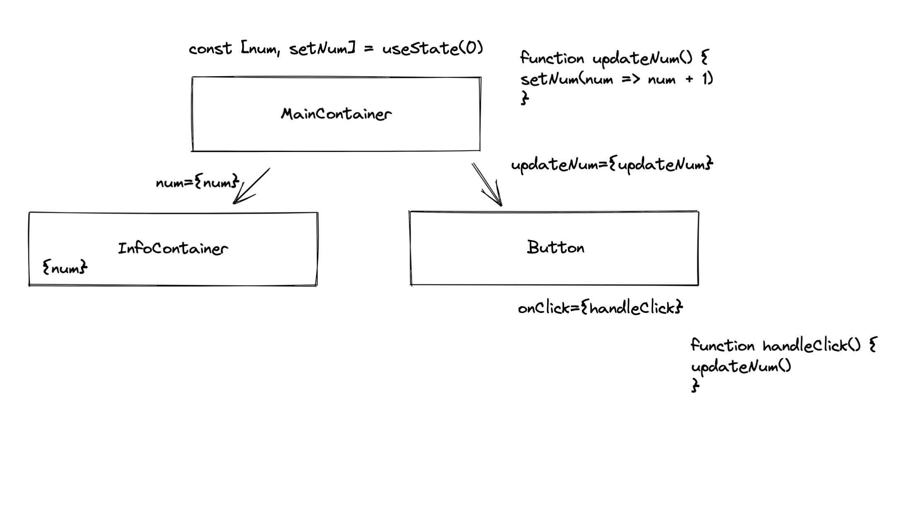

*reminder -- there are certain conditions that tell us when a variable should be set as state - condensed down from 3 rules to 2 (you're welcome!)*
should a variable be declared as state inside a particular component?
1. variable is static (i.e., won't change) - NO
2. variable was accepted as props or is derived/can be calculated from props - NO

*where should state or props be set/declared? Depending on where the state or props are needed. If multiple components need the data, we find the closest common parent.

### Inverse data flow: 
Similar to where to place props for multiple components, if one component has state and another component is in charge of updating that state, we find the closest parent component. This parent declares/holds that state via useState. State is passed as a prop to the component that needs it, and a handler function that contains the setter function (from the useState hook) is passed to the component that is tasked with updating the state.

reminder with json-server: when we need to run a server for backend (data) and one for front end, if we haven't set a particular port for json-server in our package.json script, run json-server first so we can use the 3000 port for our fetch. Also React is smart enough to seek out another port if the default is already in use. json-server is not that smart.